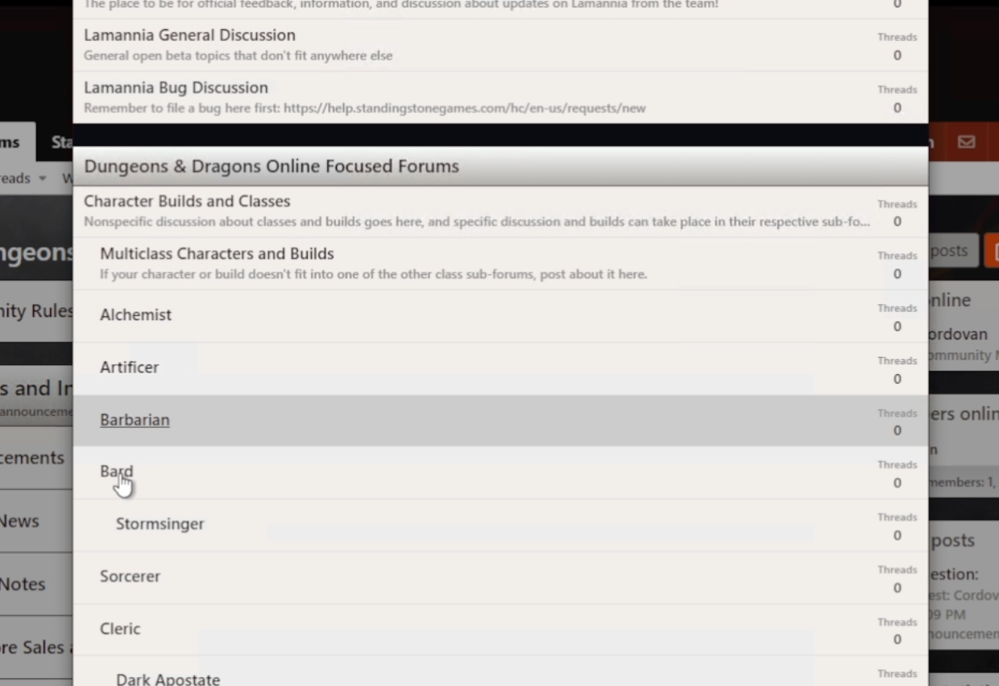

# FridaysAtFour-07-April-2023-Notes

- This week we had the first big performance change.
- They changed how bonuses are calculated behind the scenes.
- It sort of changed the order of content coming out
- Sneak peek of the new forums (no ETA, weeks rather than months), existing DDO forums will be in a read-only state when the new forums are launched.

  1. you will be chooseing a new forum name and prominant people of the community will not be having their name sniped (streamers and youtubers)
  2. You will log into the forums with the same user and pass that you use to log into the game, each forum account will be tied to a game account
  3. in many ways the new forums will be oriented the same as the old forums with some new features
  4. Images provided are a propped test, this is all a work in progress.

- Forum Page Preview Image:

  

- Can directly post in threads:

  

  

- Preview of the Editor

  

- New Spoiler Options in Editor:

  

  

- Can have a draft if you wanna do it over a couple of days or something.

  

- New Poll forum post options and what it will look like (alot of similiar options with what we have now)

  

- Replyer view

  

- New Artivle Post view, has the content at the top and user beneath their post (this is good for DDO news from the community managers)

  

- New Question Post view allows people to upvote and mark replies as solutions (Similiar to Stack overflow or reddit)

  

  

- New Creators and Makers Section. Creators (lame people that are not Voodoo) and Makers (artists, authors and such) forum section (Cringeville) to post about content and what they are up to and such - this is not going to be gated.

  

- Account options section

  

- New Profile options for users, can also change out profile picture (going to allow gravacons)

  

- New linking options for threads

  

  ## Things I Couldnt Get Screenshots of cuz the vod was deleted KEKL and other notes

- New bug discussion post that requires you to place a bug report number so that bug reports and discussions around them can be better tracked
- Better forum search and search options (was not shown)
- Dark mode is not currently with in the initial scope of the forums as it is alot of work since he has to give a new value to every element. expect to see it in the future (not gonna be there right away at launch) (Use the dark reader addon in the mean time)
- New forums will have a mobile view.
- New list options, header options, new smileys, new emotes, wider compatability with video sites, better table formatting, better previewing, and more functional options to watch your thread.
- Toggle on an off email notifications, opt in or out of weekly summaries activity emails from the forums, more email notification settings.
- Polling feature will allow people to change their votes.
- Allow the poll results to be viewed without voting - can be done right now
- They are not gonna announce where the new mount and hire are going to come from yet
- link to Codog's forum post that Strim already posted a video about: https://forums.ddo.com/forums/showthread.php/538083-Lamannia-Update-59-Preview-1-Feedback-Performance-Adjustments/page3?p=6580142#post6580142

  The figgin video got taken down for some reason in the middle of me writing notes, I think cordo might wanna re-upload it since it was so choppy with the lag and such.
